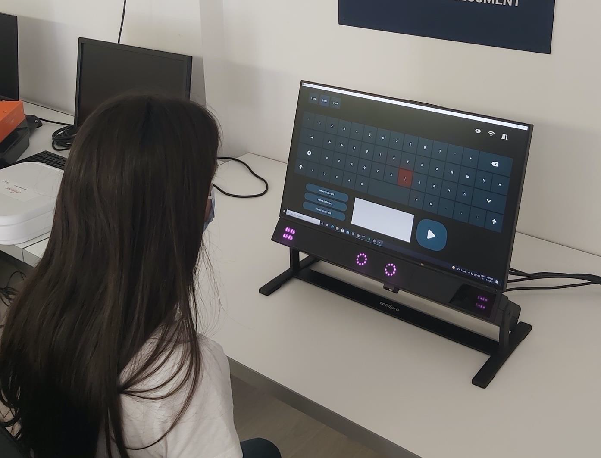

# Virtual keyboard used with eyes

Virtual keyboard desktop application that is used with eyes.  
User can "type" on the virtual keyboard with eye gaze, as opposed to using a mouse or a physical keyboard.  
Once the word is "written", user has an option for the application to say out loud the text that the user has typed.

Technologies used:
- Python
- Google Cloud Text To Speech
- Tobii Pro Eyetracker

This is a project done as a Master Thesis at the University of Belgrade, School of Electrical Engineering.  
This application is meant to help children at the __Special Hospital for Cerebral Palsy and Developmental Neurology in Belgrade__, to help them with their needs.

# Usage

# Prerequisites
- You should have Tobii Pro Eyetracker device (make sure it's the one for desktop, not the one used on the head)
- You should generate a file to authenticate on Google cloud following this instructions - https://cloud.google.com/text-to-speech/docs/before-you-begin.
- Once the file is generated, store it at the root of the application with the name *texttospeechproject.json*
- If the file doesn't exist, application will work properly, but text to speech functionality won't be available
